**Note:** For the screenshots, you can store all of your answer images in the `answer-img` directory.

## Verify the monitoring installation
TODO: run kubectl command to show the running pods and services for all components. Take a screenshot of the output and include it here to verify the installation

### Application:
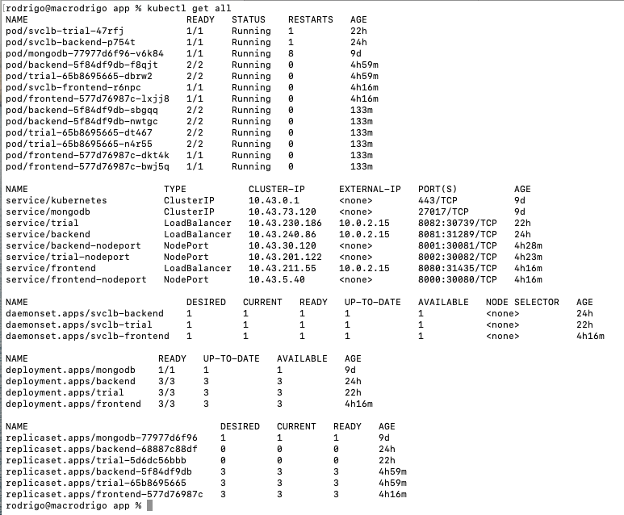

### Monitoring:
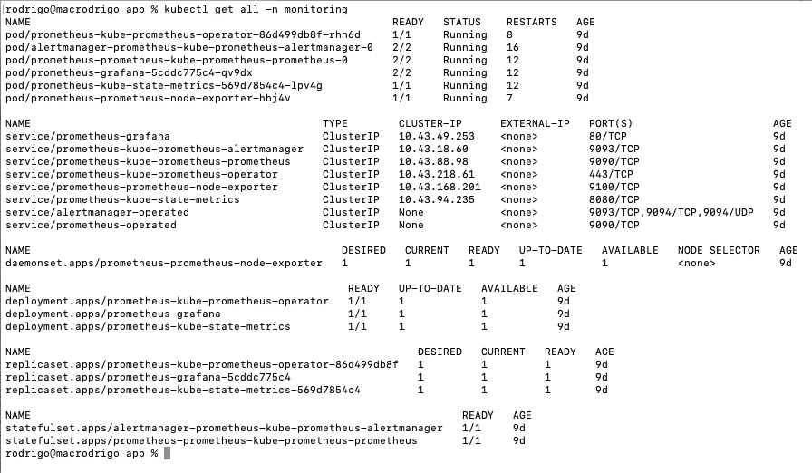

### Observability:
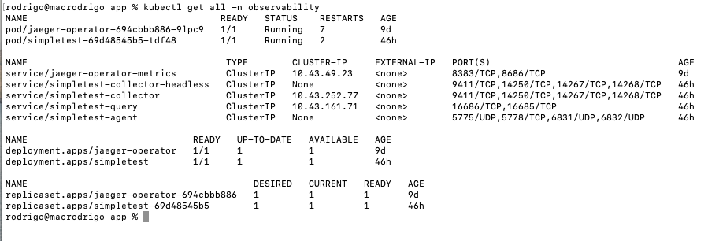

## Setup the Jaeger and Prometheus source
TODO: Expose Grafana to the internet and then setup Prometheus as a data source. Provide a screenshot of the home page after logging into Grafana.

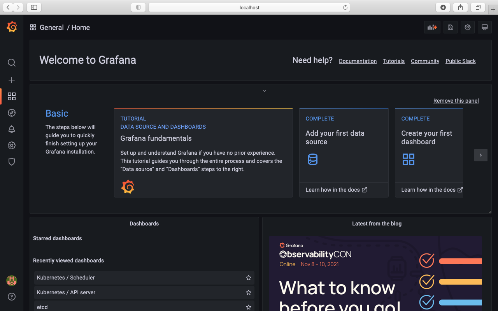

## Create a Basic Dashboard
TODO: Create a dashboard in Grafana that shows Prometheus as a source. Take a screenshot and include it here.

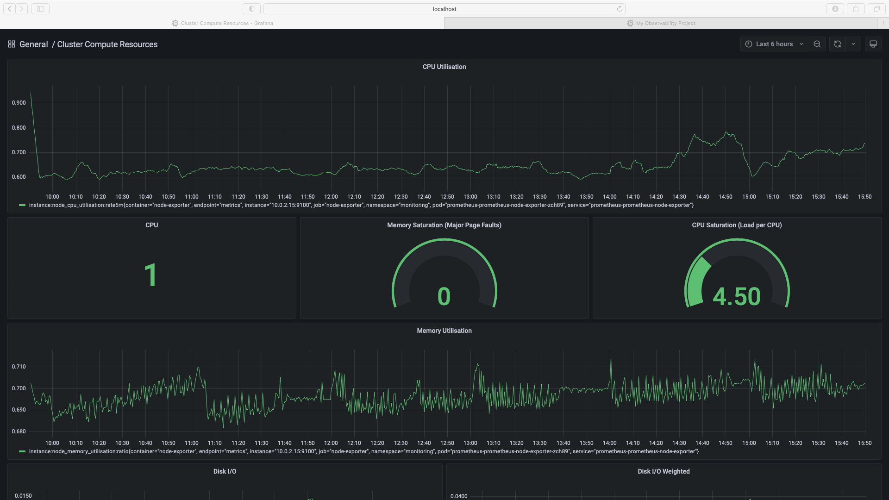

## Describe SLO/SLI
*TODO:* Describe, in your own words, what the SLIs are, based on an SLO of *monthly uptime* and *request response time*.

SLI (Service Level Indicators) are metrics that indicate whether we have achieved our SLOs (Service Level Objectives).

Based on SLOs of monthly uptime and request response time, SLIs are:

* Last month application uptime was 99.95%;
* Last month 93% of requests to the backend service responded in less than 300ms.

## Creating SLI metrics.
*TODO:* It is important to know why we want to measure certain metrics for our customer. Describe in detail 5 metrics to measure these SLIs.

* Uptime, or the percentage of time the website/webservices are available and functioning;
* Saturation, or the overall capacity of a service (such as the percentage of memory or CPU used);
* Traffic, or the amount of stress on a system from demand (such as the number of HTTP requests/second);
* Latency, or the time taken to serve a request (usually measured in ms);
* Errors, or the number of requests that are failing (such as number of HTTP 500 responses).

## Create a Dashboard to measure our SLIs
*TODO:* Create a dashboard to measure the uptime of the frontend and backend services We will also want to measure to measure 40x and 50x errors. Create a dashboard that show these values over a 24 hour period and take a screenshot.

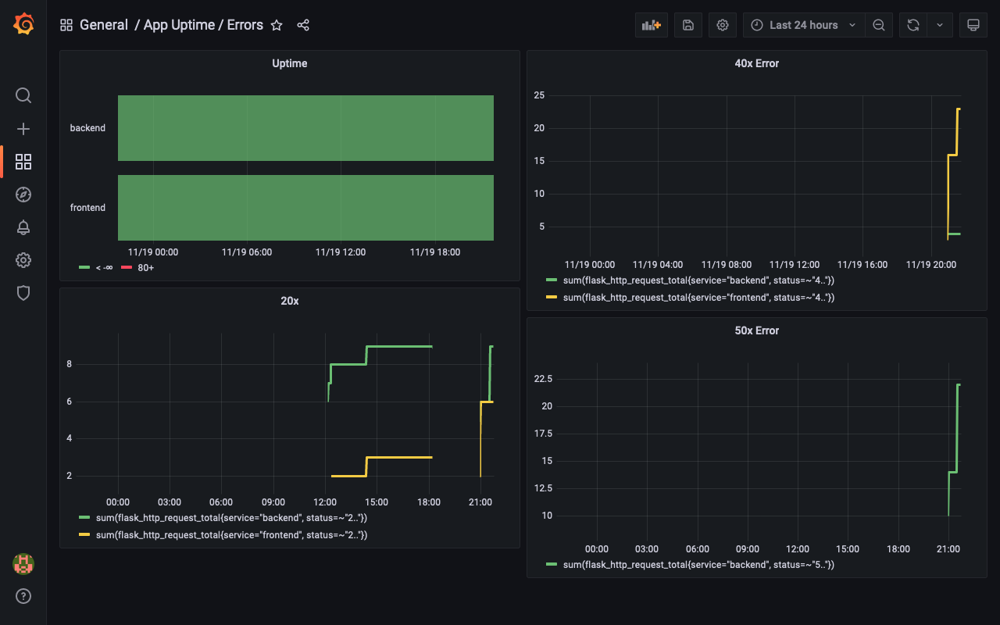

## Tracing our Flask App
*TODO:*  We will create a Jaeger span to measure the processes on the backend. Once you fill in the span, provide a screenshot of it here.

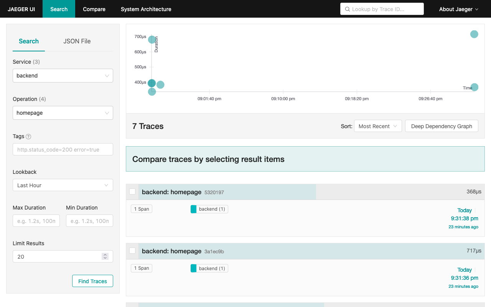

## Jaeger in Dashboards
*TODO:* Now that the trace is running, let's add the metric to our current Grafana dashboard. Once this is completed, provide a screenshot of it here.

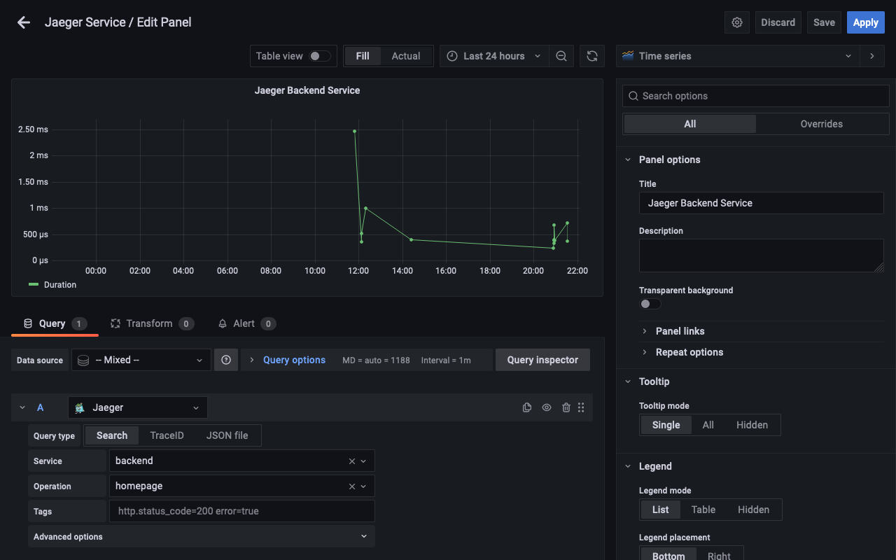

## Report Error
*TODO:* Using the template below, write a trouble ticket for the developers, to explain the errors that you are seeing (400, 500, latency) and to let them know the file that is causing the issue.

TROUBLE TICKET

Name: 500 Server Error on Trial API endpoint
 
Date: 20/11/2021 18:35:10

Subject: 500 Server Error on Trial API endpoint

Affected Area: Home directory of Trial API 

Severity: High

Description: Starting from today, all requests sent to the Trial API have returned error. We've  traced the error back to the message "trial: get-python-jobs".

## Creating SLIs and SLOs
*TODO:* We want to create an SLO guaranteeing that our application has a 99.95% uptime per month. Name three SLIs that you would use to measure the success of this SLO.

1. 99% application uptime per month;
2. Server resources do not exceed 90% usage per month;
3. More than 95% of requests must execute successfully and without errors;
4. 90% of all requests repond below 250ms.

## Building KPIs for our plan
*TODO*: Now that we have our SLIs and SLOs, create KPIs to accurately measure these metrics. We will make a dashboard for this, but first write them down here.

* Server uptime > 99%;
* Deployment uptime > 99%;
* CPU Utilization < 90%;
* Disk Drive Utilization < 90%;
* RAM Memory Utilization < 90%;
* Successful responses per month > 95% of requests;
* Error responses per month < 0.5% of requests;
* Average Response Time < 250ms;
* Percentage of requests with latency of less than 250ms > 90%.

## Final Dashboard
*TODO*: Create a Dashboard containing graphs that capture all the metrics of your KPIs and adequately representing your SLIs and SLOs. Include a screenshot of the dashboard here, and write a text description of what graphs are represented in the dashboard.

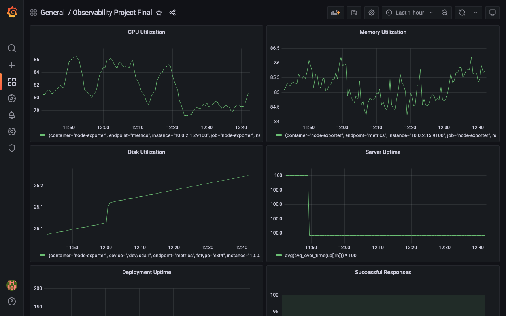

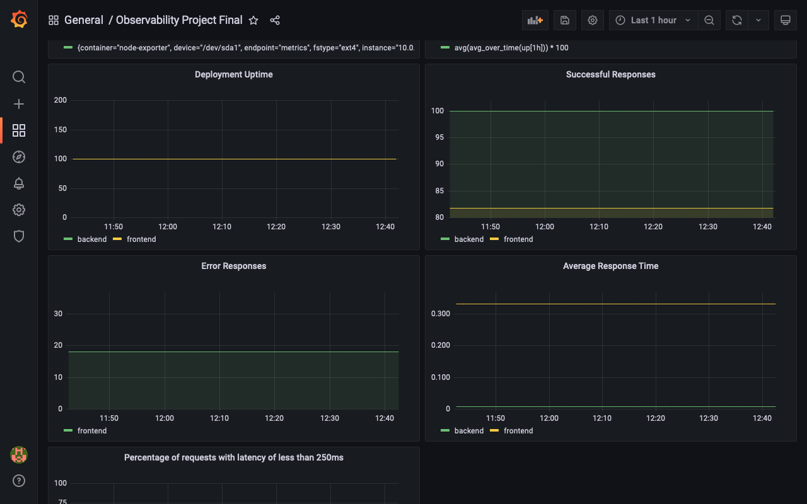

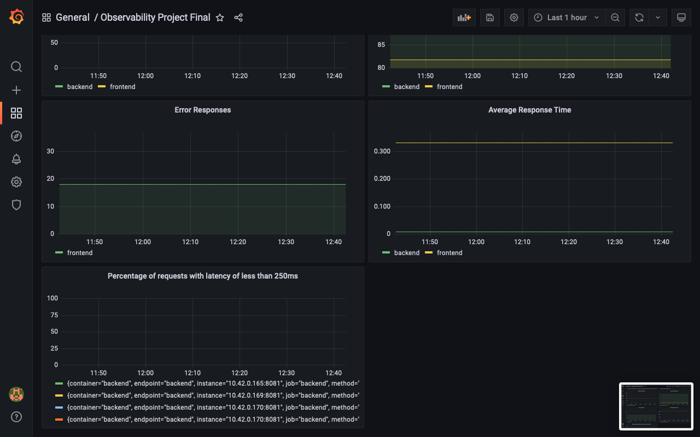

* Server Uptime - instance uptime;
* Deployment Uptime - uptime of the backend and frontend services;
* CPU Usage - how much cpu is being used currently;
* Disk Usage - how much disk drive space is being used currently;
* Memory Usage - how much RAM memory is being used currently;
* Successful Responses - total number of successful requests per month by service;
* Error Responses - total number of error requests per month by service and statuses.
* Average Response Time - average response time in ms for successful requests;
* Requests under 250ms - percentage of successful requests finished within 250ms.
